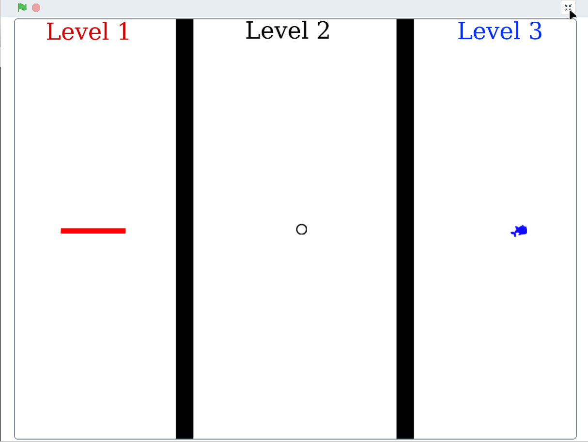

# Hide and seek

In this game there are 3 different levels in which you have to find 3 different objects on 3 different backgrounds.

To confirm that you have found an object you have to hover over it with the mouse (sometimes you have to hover over it several times)

Close your eyes for 4 seconds after you started the game or found an object. After 4 seconds it is time to look for the next object 
