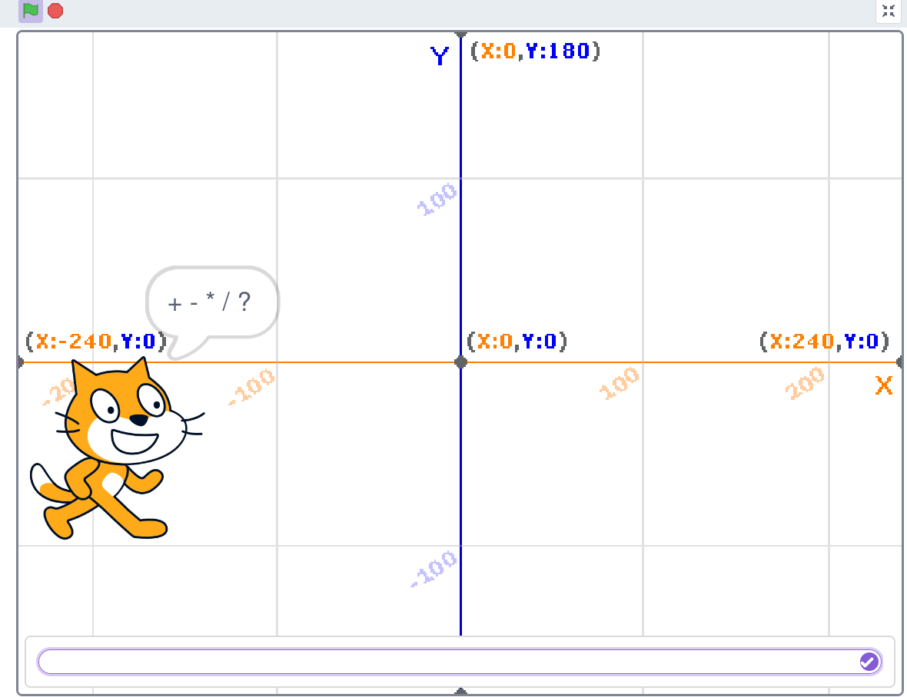

# Calculator

Here I have created a small calculator that you can use to learn how something like this works in scratch

| sign | calculation|
| --- | --- |
| + | plus
| - | minus
| * | meal
| / | divided
